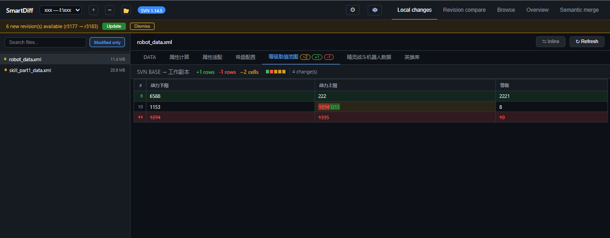
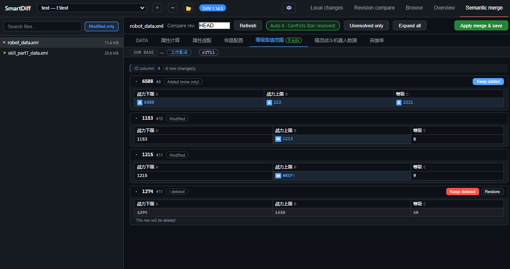

# SmartDiff

[English](README.md) · **中文**

[](LICENSE)
[](https://www.python.org/downloads/)
[](https://github.com/noahsarkcc/smartdiff/actions/workflows/test.yml)
[](https://github.com/noahsarkcc/smartdiff/releases)

> **v1.4.2** · 面向表格配置的语义化 Diff 与三方合并工具

SmartDiff 是一个零依赖、可本地运行的表格 Diff 工具，专为以 Excel 表格（`.xml` / `.xlsx` / `.xls`）维护的结构化配置数据而设计。它自动过滤样式、窗口状态、列宽等元数据噪音，**只呈现真正的数据变更**，并提供基于行 ID 的智能匹配、单元格级三方语义合并，以及可选的 SVN 版本集成。

- 解析与 Diff 支持 `.xml`（SpreadsheetML 2003）、`.xlsx`（Office Open XML）和 `.xls`
- 单元格级三方语义合并当前仅支持 `.xml`
- 后端 Flask + 前端零依赖 SPA，可直接 `python server.py` 启动，也可打包成单文件 exe

---

## 界面截图

**本地变更** — 只高亮真正的数据变更：绿色行为新增，红色行为删除，黄色单元格为修改（旧值 → 新值）。

<p align="center">
  
</p>

**版本总览** — GitHub 风格的 "Files changed"，一次查看两个版本间所有文件的变更；图中为分行视图（旧值在上、新值在下）。

<p align="center">
  
</p>

**语义合并** — 基于 `BASE / 本地 / 远程` 的单元格级 + 行级三方决议，结果写回原始 `.xml`。

<p align="center">
  
</p>

---

## 目录

- [界面截图](#界面截图)
- [功能特性](#功能特性)
- [安装 & 启动](#安装--启动)
- [使用说明](#使用说明)
- [测试](#测试)
- [常见问题](#常见问题)
- [更新日志](#更新日志)
- [相关文档](#相关文档)

---

## 功能特性

| 类别 | 能力 |
|---|---|
| **Diff 核心** | 四种模式：本地变更（工作副本 vs BASE）、版本对比（任意两个 SVN 版本）、浏览（解析后表格视图）、版本总览（GitHub 风格的 "Files changed"，一次查看两个版本间所有文件的变更）。自动 ID 列检测按内容匹配行而非行号，插入 / 删除不会产生级联假修改。注释列（无表头）自动从 Diff 排除。修改单元格内智能 token 级高亮（数字 / 单词整块对比），支持内联 / 分行（旧值、新值上下两行）视图切换。 |
| **三方合并** | `BASE / 本地 / 远程` 单元格级 + 行级自动合并（仅 `.xml`）。同一单元格双方改不同值、删除 vs 修改、双方加同 ID 不同内容可逐项手动决议后写回原 XML。 |
| **SVN 集成** | 远程版本轮询（顶部横幅提醒）；智能更新分类处理冲突（保留我的 / 用最新 / 跳过 / 对 `.xml` 进入语义合并）；合并完成后自动 `svn resolve --accept working`。版本历史经远程 URL 获取，无需 `svn update`。 |
| **格式与体验** | 可解析 `.xml`（SpreadsheetML 2003）、`.xlsx`（Office Open XML）和 `.xls`，统一 Diff 视图；可配置表头起始行，支持前几行是 obj/type/desc/key 等元信息的特殊表格；多 Sheet、多工作区、文件变更自动刷新、大表格分批渲染。 |
| **自动更新** | 应用内检查更新（设置齿轮红点提示），exe 模式一键下载新版并自动替换重启。 |

---

## 安装 & 启动

### 方式一：直接下载 exe（推荐）

从 [Releases](https://github.com/noahsarkcc/smartdiff/releases) 下载最新的 `SmartDiff.exe`，双击即可运行，无需安装 Python。后续有新版本时可在应用内一键更新。

### 方式二：源码运行

环境要求：

- Python 3.8+
- Flask / openpyxl / xlrd（`pip install -r requirements.txt`）
- SVN 命令行工具（可选，TortoiseSVN 的 svn.exe 也可以）

```bash
# 安装依赖
pip install -r requirements.txt

# 启动服务
python server.py
```

或者直接双击 `start.bat`。

启动后浏览器会自动打开 `http://localhost:5566`。

### 配置工作区

首次启动会生成 `config.json`，可手动编辑或在界面上添加：

```json
{
  "workspaces": [
    {"name": "项目A", "path": "D:\\svn\\project_a\\xml"},
    {"name": "项目B", "path": "D:\\svn\\project_b\\xml"}
  ],
  "active_workspace": 0,
  "header_row": 1
}
```

在页面顶部的下拉框中可以切换工作区，点击 `+` 添加新工作区，点击 `×` 删除当前工作区。`header_row` 为表头起始行，也可在界面设置中修改（见下文）。

---

## 使用说明

### 本地变更模式

选择左侧文件，自动对比工作副本与 SVN BASE 版本。绿色行表示新增，红色行表示删除，黄色单元格表示修改（显示旧值 → 新值）。

### 内联 / 分行视图

修改单元格有两种显示方式：**内联**（旧值 → 新值同行展示）和**分行**（旧值在上、新值在下）。点击工具栏按钮即可切换，选择会被记住，适用于所有 Diff 视图。

### 版本对比模式

选择文件后，从下拉框中选择旧版本和新版本，点击"对比版本"。

### 版本总览模式

不需要选文件。选择两个版本号，点击"对比版本"，会列出所有变更文件及其详情。支持"仅数据变更"过滤。

### 浏览模式

以表格形式查看文件内容，支持多 Sheet 切换。

### 语义合并模式

切换到"语义合并"后，左侧仅显示 `.xml` 文件。选择文件后，工具会从 SVN 读取 `BASE` 和远程版本，与当前工作副本做三方对比：

- 单方修改、双方同改、双方改不同列会自动决议
- 同一单元格双方改成不同值、删除 vs 修改、双方新增同 ID 不同内容会要求手动选择
- 决议完成后点击"应用合并并保存"，结果会写回本地 `.xml`
- 如果入口来自 SVN 冲突弹窗，保存后会自动尝试标记 SVN 冲突已解决

### SVN 更新

当检测到远程仓库有新版本时，页面顶部会显示黄色提醒横幅。点击"更新"按钮：

- 如果没有冲突，直接更新
- 如果有冲突（本地有修改 + 远程也有修改），会弹出冲突处理面板，对每个冲突文件可以选择：
  - **保留我的**：保留本地修改
  - **用最新**：使用服务器版本覆盖
  - **跳过**：该文件不参与本次更新
  - **语义合并**：仅 `.xml` 文件显示，进入单元格级三方合并

冲突检测按工作区相对路径匹配，子目录中的同名 XML 文件也会正确识别，例如 `configs/items.xml`。

### 设置：表头起始行

点击右上角齿轮打开设置。如果表格前几行是 obj/type/desc/key 等元信息，可将「表头起始行」设为实际列名所在行，ID 检测与列名展示都会按此处理。

### 检查更新

应用启动后会自动在后台检查新版本，发现新版本时设置齿轮上会出现红点。打开设置可查看当前版本并点击「检查更新」：

- exe 模式下可一键下载新版本，完成后自动替换并重启
- 源码模式下请使用 `git pull` 获取最新代码

---

## 测试

在项目根目录运行：

```powershell
python tests\test_merger.py
python tests\test_differ.py
python tests\test_updater.py
python tests\test_api_merge.py
```

当前覆盖：

- `test_merger.py`：29 个合并引擎用例，覆盖 5 种单元格状态、10 种行级状态、决议校验、XML 写回 roundtrip、ExpandedRowCount 维护和注释保留
- `test_differ.py`：11 个 diff 引擎用例，覆盖三遍行匹配（ID / 内容哈希 / 行号回退）、重复 ID、注释列过滤、header_row>1 的 ID 检测和 UTF-16 解析
- `test_updater.py`：23 个更新模块用例，覆盖版本号比较、代理回退、release 解析、下载状态机、自替换更新脚本和 `/api/update/*` 端点
- `test_api_merge.py`：16 个 API 用例，覆盖 preview / apply / svn-mark-resolved / 文件列表递归 / 路径穿越拒绝 / SVN update check_only 子目录冲突检测

完整的手工测试流程见 [tests/TESTING.zh-CN.md](tests/TESTING.zh-CN.md)。

---

## 常见问题

**Q：为什么有些列不显示？**

A：没有表头的列被视为注释数据，不会显示在 Diff 结果中。这些列也不会进入导表产物。

**Q：为什么修改了一行但没有显示大量变化？**

A：工具会自动检测 ID 列进行智能匹配。插入 / 删除一行只会显示那一行变化，其余行不受影响。

**Q：没有安装 SVN 怎么办？**

A：工具会自动检测 SVN CLI。如果未安装，"本地变更"和"版本对比"功能不可用，但"浏览"模式仍然可用。

**Q：页面打开很慢 / 表格卡顿？**

A：工具对超过 150 行的表格使用分批渲染。如果文件本身非常大（>5MB），解析可能需要几秒。

**Q：版本列表不是最新的？**

A：工具已改用远程 URL 获取版本历史，无需 `svn update` 即可看到最新提交。如需将文件内容拉到本地，使用页面顶部的"更新"按钮。

---

## 更新日志

完整版本历史见 [CHANGELOG.zh-CN.md](CHANGELOG.zh-CN.md)。

---

## 相关文档

- [开发文档](DEVELOPMENT.zh-CN.md) — 架构、模块详解、API 列表、扩展指南
- [测试指南](tests/TESTING.zh-CN.md) — 自动化测试 + 手工 UI 测试流程
